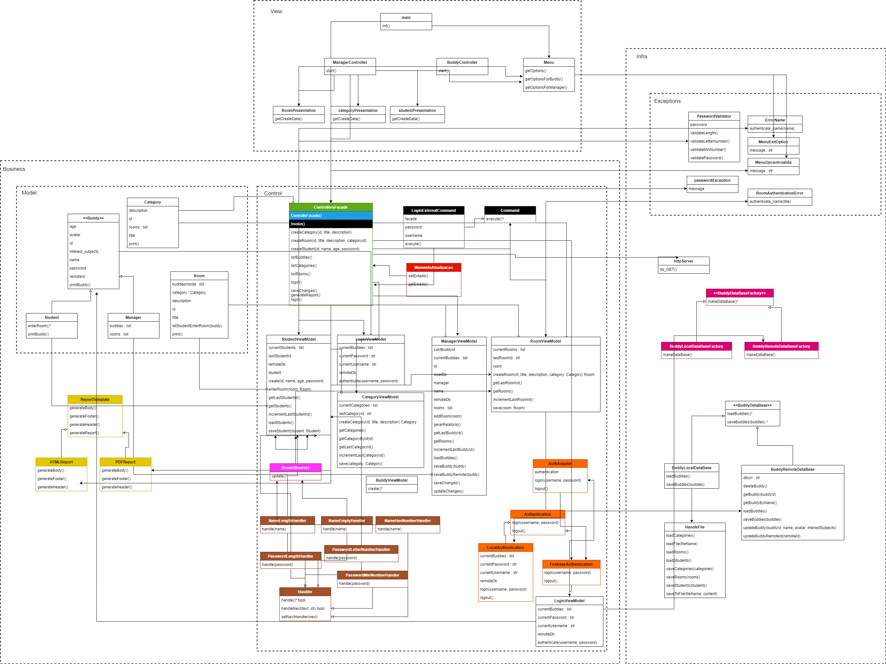
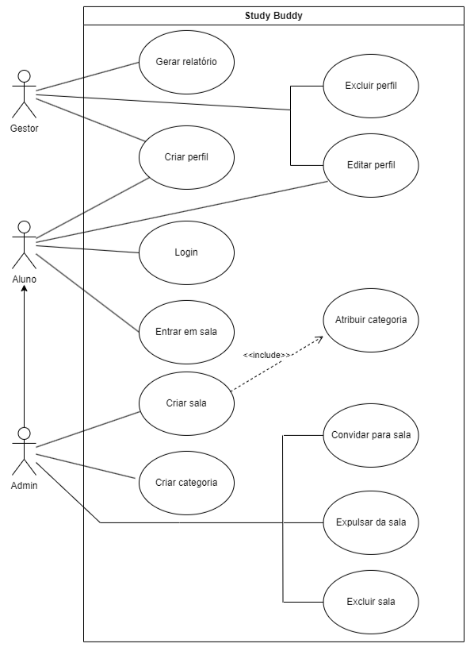

# Study Buddy Platform

Esse respositório contempla Projeto desenvolvido para a disciplina de Métodos de Projetos de Software.

## Professor

Raoni Kulesza

## Integrantes

20230145258  André Iarley Soares De Cruz 
20180161275  Calebe Rodrigues De Almeida 
20190023871  Lucas Eduardo Melo Alves  
20180081254  Maria Catarina Serrano De Lacerda   		
20180002250  Vinicius Amaral Monteiro De Almeida    	

## Instalação

### python version
python version 3.10.11

### run
pip install -r requirements.txt  
python ./src/main.py	

## Diagramas

### Diagrama de Classes V0.0.3

Legenda:  
🟩 Padrão Facade  
🟦 Padrão Singleton  
🟨 Padrão Template  
🟧 Padrão Adapter  
🟪 Padrão Factory   
⬛ Padrão Command  
🟫 Padrão Chain of Responsibility   
🟥 Padrão Memento    
🩷 Padrão Observer  

### Diagrama de Casos de Uso V0.0.3

## Padrões de projeto

### 🟦 Singleton:

#### Aplicação
O Singleton é um padrão de projeto que garante que uma classe tenha apenas uma instância e fornece um ponto de acesso global a essa instância.
#### Vantagens
É útil quando uma única instância de uma classe precisa coordenar ações em todo o sistema, como um gerenciador de configuração ou um pool de conexão de banco de dados.
#### Classes
ControllersFacade
	

### 🟩 Facade:

#### Aplicação
O padrão Facade fornece uma interface simples para interagir com um subsistema complexo. Ele oculta a complexidade subjacente e fornece um ponto de entrada único.
#### Vantagens
Facilita a manutenção, melhora a legibilidade do código e permite aos clientes interagir com o sistema de forma mais simples.
#### Classes
ControllersFacade

### 🟪 Factory:

#### Aplicação
O padrão Factory é usado para criar objetos sem especificar a classe exata do objeto que será criado. Ele fornece uma interface para criar objetos em subclasses.
#### Vantagens
Isso promove a flexibilidade e facilita a criação de objetos, permitindo que o código cliente seja independente da classe concreta que está sendo criada.
#### Classes
BuddyRemoteDataBaseFactory, BuddyLocalDataBaseFactory, BuddyDataBaseFactory.

### 🟨 Template:

#### Aplicação
O padrão Template define a estrutura de um algoritmo, permitindo que etapas específicas sejam implementadas por subclasses.
#### Vantagens
Torna a estrutura do algoritmo mais flexível, permitindo a personalização de partes específicas, enquanto mantém a estrutura geral.
#### Classes
ReportTemplate, PDFReport, HTMLReport.

### 🟧 Adapter:

#### Aplicação
O padrão Adapter é usado para permitir que interfaces incompatíveis trabalhem juntas. Ele atua como um intermediário entre dois sistemas incompatíveis.
#### Vantagens
Facilita a integração de sistemas legados com novos sistemas e promove a reutilização de código existente.
#### Classes
AuthAdapter, Authentication, FirebaseAuthentication, LocalAuthentication, LoginViewModel.

### ⬛ Command:

#### Aplicação
O padrão Command encapsula uma solicitação como um objeto, permitindo que você parametrize clientes com operações, filas, desfaça ações, etc.
#### Vantagens
Facilita o desacoplamento entre remetentes e destinatários de comandos, possibilita a reversão de ações e oferece suporte a operações complexas.
#### Classes
LoginExternalCommand, Comman, ControllersFacade.

### 🟥 Memento:

#### Aplicação
O padrão Memento captura e externaliza o estado interno de um objeto, permitindo que ele seja restaurado posteriormente.
#### Vantagens
É útil para implementar o desfazer/refazer funcionalidade e manter o histórico de estados de um objeto.
#### Classes
MementoAtualizacao.

### 🟫 Chain of Responsibility:

#### Aplicação
O padrão Chain of Responsibility permite que você construa uma cadeia de objetos que processam solicitações sequencialmente, passando a solicitação ao próximo objeto na cadeia, se necessário.
#### Vantagens
Permite a flexibilidade na manipulação de solicitações, evitando acoplamento rígido entre remetente e destinatário e simplificando a adição ou remoção de manipuladores.
#### Classes
Handler, NameEmptyHandler, NameHasNumberHandler, NameLengthHandler, PasswordLenghtHandler, PasswordLetterNumberHandler, PasswordMinNumberHandler, NameValidator, PasswordValidator

### 🩷 Observer:

#### Aplicação
O padrão Observer define uma relação um-para-muitos entre objetos, de modo que quando um objeto muda de estado, todos os seus observadores são notificados e atualizados automaticamente.
#### Vantagens
Facilita a comunicação entre objetos e permite que os observadores reajam dinamicamente a mudanças de estado, sem acoplar fortemente o emissor de eventos.
#### Classes
RoomObserver, RoomViewModel, ManagerViewModel, StudentViewModel.

