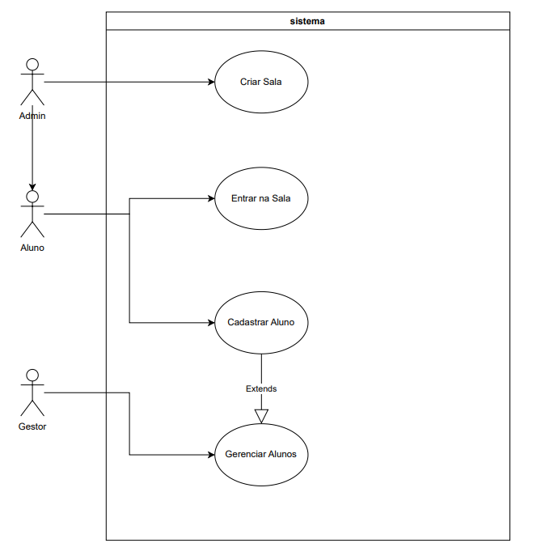

# Study Buddy Platform

Projeto desenvolvido para a disciplina de Métodos de Projetos de Software.

## Professor

Raoni Kulesza

## Integrantes

André Iarley Soares De Cruz		        20230145258
Calebe Rodrigues De Almeida			    20180161275
Lucas Eduardo Melo Alves				20190023871
Maria Catarina Serrano De Lacerda		20180081254
Vinicius Amaral Monteiro De Almeida		20180002250

## Diagramas

