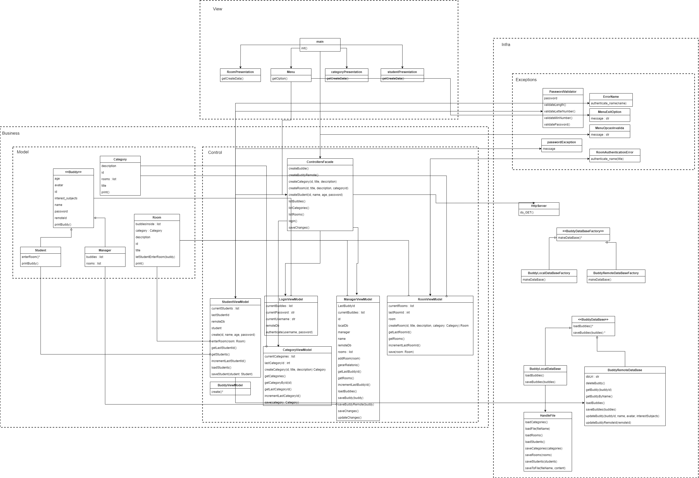

# Study Buddy Platform

Esse respositório contempla Projeto desenvolvido para a disciplina de Métodos de Projetos de Software.

## Professor

Raoni Kulesza

## Integrantes

20230145258  André Iarley Soares De Cruz 
20180161275  Calebe Rodrigues De Almeida 
20190023871  Lucas Eduardo Melo Alves  
20180081254  Maria Catarina Serrano De Lacerda   		
20180002250  Vinicius Amaral Monteiro De Almeida    	

## intalação

### python version
python version 3.10.11

### run
pip install -r requirements.txt
python ./src/main.py	

## Diagramas

### Diagrama de Classes V0.0.2

### Diagrama de Casos de Uso V0.0.1

